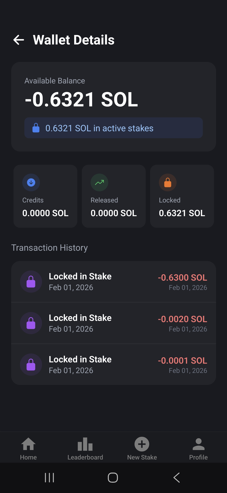
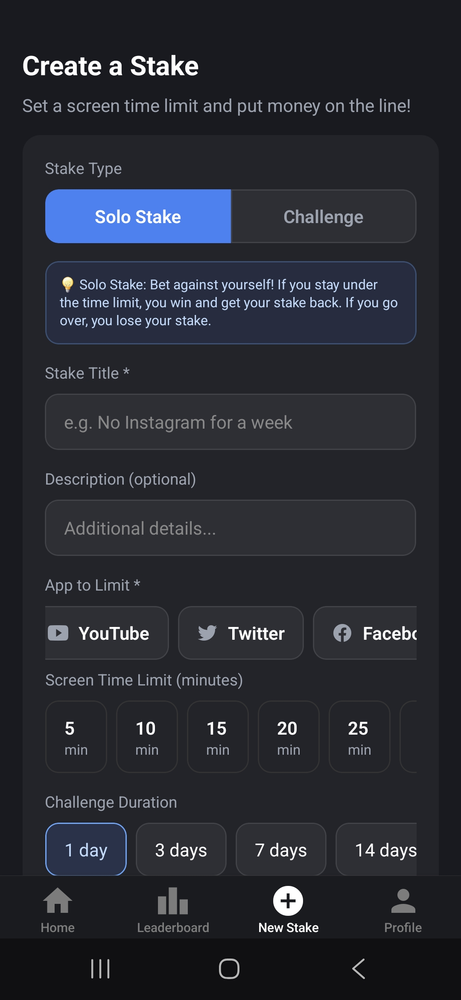
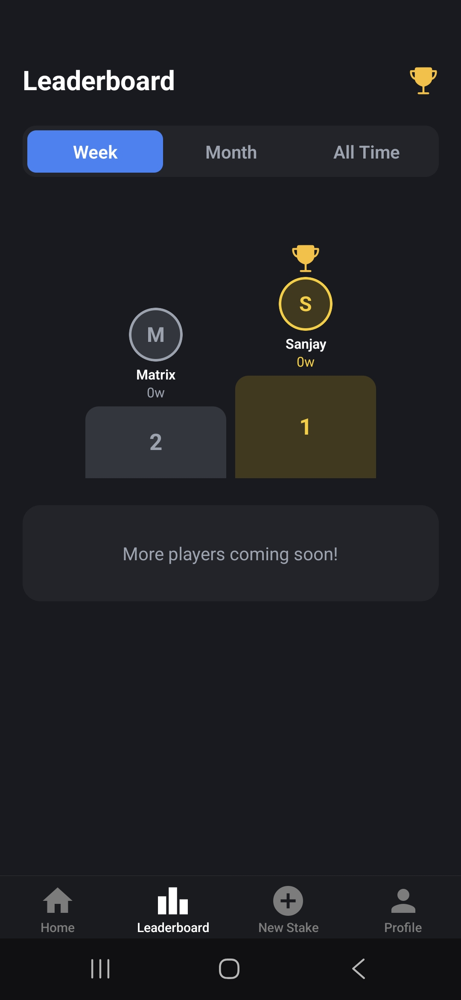

# ZeroScroll

ZeroScroll for better digital habits and stay focused. It encourages mindful device usage by letting you set personal commitments, track your screen time, and join a supportive community where everyone works towards healthier tech habits together.

## Commitment Feature

With ZeroScroll, you can pick a friend and send them your commitment. This means you pledge to use the app for a certain period. If you break your commitment, your friend receives a reward—money which is sent to them through an escrow system. This adds real accountability and makes your digital goals more meaningful!

## How does it work?

1. **Pick a Friend:** Select a friend to be your accountability partner.
2. **Set Your Commitment:** Decide how long you’ll stick to your screen time goal and how much you’ll stake.
3. **Escrow System:** Your stake is held securely. If you succeed, you keep your money. If you fail, your friend gets the reward!
4. **Track Progress:** The app automatically monitors your screen time and shows your progress in real-time.
5. **Earn Rewards:** Stay consistent and unlock badges or rewards as you reach your goals.

ZeroScroll makes it easy and fun to take control of your digital life, with a simple interface, real accountability, and a focus on positive change.

---

## App Demo

<!-- Place screenshots or images of the app here -->

<!-- Place a video walkthrough or demo link here -->

**[Video Demo Placeholder]**
<video width="320" height="240" controls>

<source src="./assets/1000052143.mp4" type="video/mp4">
Your browser does not support the video tag.
</video>

---

---

# zeroscroll

Vibecoded due to deadline. I will continue writting manually again from where I left before vibecoded.
