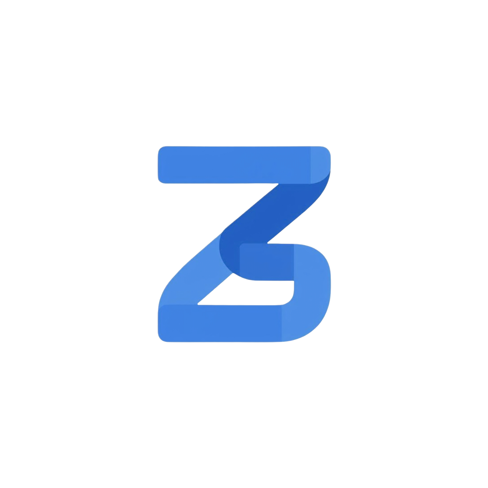
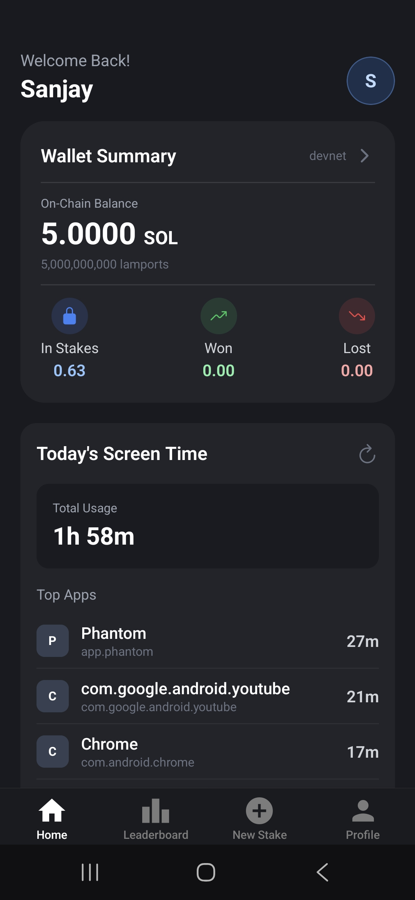
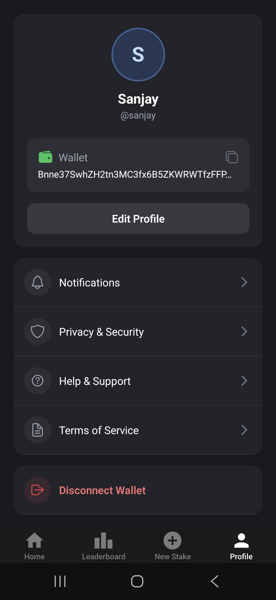

<p align="center">
  
</p>

<h1 align="center">ZeroScroll</h1>
<p align="center">
  
  
  
  
</p>

<p align="center">
  <b>Stake your focus. Win your discipline.</b><br/>
</p>

ZeroScroll is a Solana-powered mobile app that helps you build better digital habits by staking real money on your screen time goals. If you fail, your friend wins your stake. Real accountability, real rewards, powered by blockchain.

---

## Problem Statement

**Digital addiction is real.** Millions struggle with mindless scrolling, but most habit-tracking apps rely only on willpower—which often isn't enough.

**ZeroScroll solves this** by adding financial accountability through Solana's escrow system. When real money is on the line, you're far more likely to stick to your goals.

---

## Why ZeroScroll?

- **Financial Accountability:** Stake SOL on your commitment. Succeed and keep your money. Fail and your friend gets rewarded.
- **Powered by Solana:** Fast, low-cost transactions via Solana blockchain and Phantom wallet integration.
- **Social Motivation:** Pick a friend as your accountability partner—making it personal and fun.
- **Real Impact:** Helps reduce screen time, boost productivity, and build healthier digital habits.

---

## 🔧 How It Works

1. **Pick a Friend:** Select a friend to be your accountability partner.
2. **Set Your Commitment:** Choose your screen time goal and stake SOL.
3. **Escrow System:** Your stake is held securely on Solana. If you succeed, you keep your money. If you fail, your friend gets the reward!
4. **Track Progress:** The app monitors your screen time in real-time.
5. **Earn Rewards:** Stay consistent and unlock achievements.

---

## Tech Stack

| Layer      | Technology                        |
| ---------- | --------------------------------- |
| Mobile     | React Native (Expo)               |
| Backend    | Rust (Axum, SQLx, PostgreSQL)     |
| Blockchain | Solana (Devnet), Phantom Wallet   |
| Escrow     | Solana Native (SPL, Escrow Logic) |

---

## 📦 Project Structure

```
zeroscroll/
├── zeroscroll/      # React Native mobile app (Expo)
├── zcrow/           # Rust backend (Axum, SQLx, PostgreSQL)
└── assets/          # Screenshots, demo video
```

---

## 🚀 Setup Instructions

### Prerequisites

- Node.js & npm
- Rust & Cargo
- PostgreSQL
- Expo CLI
- Phantom Wallet (mobile)

### Backend (Rust)

```bash
cd zcrow
cp .env.example .env
# Edit .env with your database URL and secrets
cargo build --release
cargo run --release
```

### Mobile App (Expo)

```bash
cd zeroscroll
npm install
npx expo start
```

---

## App Demo





### Video Demo

<video width="480" height="320" controls>
  <source src="https://drive.google.com/uc?export=download&id=1V7qbTH7UEnkAQDOHFracS8x0_rhsTat2" type="video/mp4">
  Your browser does not support the video tag.
</video>

[Click here to play the video directly](https://drive.google.com/file/d/1V7qbTH7UEnkAQDOHFracS8x0_rhsTat2/view)

---

## Live Link

> _Coming soon!_ (APK or Expo link will be added here)

---

## Team

| Name       | Role                 |
| ---------- | -------------------- |
| freaktopus | Full Stack Developer |

_Solo submission for Superteam Nepal_

---

## Solana Integration Highlights

- **Phantom Wallet:** Seamless wallet connection for staking and payouts.
- **Escrow on Solana:** Stakes are held trustlessly and released based on commitment results.
- **Devnet Ready:** All transactions run on Solana Devnet for hackathon demo.

---

## Acknowledgements

Built for **Superteam Nepal**.

---
